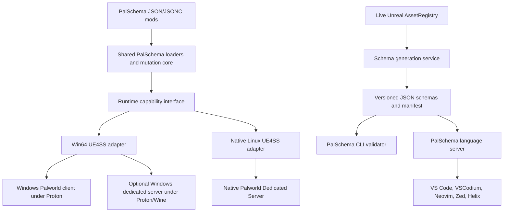

# PalSchema Linux Port and Cross-Distro Mod Development Plan

Status: execution in progress
Prepared: 2026-07-25
Upstream baseline: `Okaetsu/PalSchema` `main` at `75137ef`, tag `0.6.1`
Primary development host: CachyOS
Target contribution path: `LAP87/PalSchema` fork to `Okaetsu/PalSchema`

## 1. Executive decision

This project will treat "Linux support" as three related deliverables, not as
one ambiguous binary port:

1. **Linux-hosted PalSchema development for the Windows Palworld client**
   - Build the Win64 PalSchema DLL entirely from Linux.
   - Install and run it with the Windows Palworld client under Steam/Proton.
   - Preserve every mod-development feature currently available on Windows.
   - This is the first runtime parity milestone because the Palworld desktop
     client installed on Linux is still the Windows build.

2. **Native Linux Palworld Dedicated Server support**
   - Build PalSchema as an ELF shared object for the native Linux server.
   - Use the official/native UE4SS Linux C++ mod ABI when that ABI is ready.
   - Prototype against the current upstream draft only in an explicitly
     experimental lane.
   - Do not call this stable or 1:1 until the native server feature matrix has
     passed against an isolated native PalServer instance.

3. **Distro-neutral authoring tools**
   - Keep JSON Schema as the canonical mod-authoring contract.
   - Add a standalone validator/CLI and a Language Server Protocol server.
   - Add a thin VS Code/VSCodium extension and documented setup for other
     Linux editors.
   - Support both `.json` and `.jsonc`.
   - Ship these tools independently of Palworld, Steam, Proton, and UE4SS.

The release will **not bundle UE4SS**. Users will install a compatible UE4SS
build separately. PalSchema will publish a machine-readable compatibility
manifest and provide a `doctor` command that verifies the user's installation.

## 2. Why this split is necessary

The word "Linux" currently refers to two different runtime ABIs:

- The Steam Palworld client is a PE/COFF Win64 executable running through
  Proton. PalSchema must therefore remain a Win64 DLL at runtime even if it was
  compiled on Linux.
- Palworld Dedicated Server has a native x86-64 ELF build. A plugin for that
  process needs Linux-compatible UE layouts, signatures, hooks, loader entry
  points, paths, and shared-library exports.

Cross-compiling the existing Win64 target on Linux is materially smaller and
less risky than creating the native server target. The project will ship useful
Linux mod-development improvements as soon as the first lane is complete,
without misrepresenting the native server port as finished.

## 3. Verified baseline

### 3.1 Repository

- The checkout is at `/home/lenny/apps/PalSchema`.
- Upstream is `https://github.com/Okaetsu/PalSchema`.
- Baseline release is `0.6.1`, published 2026-07-19.
- The repository and PalSchema source are MIT-licensed.
- The pinned dependency is `Okaetsu/RE-UE4SS` at
  `c838a8acaade1a0f860bdf249f039e58f4e10088`.
- PalSchema directly links UE4SS, Zydis, Zycore, SafetyHook, nlohmann-json,
  Glaze, and efsw.
- The current top-level CMake file only defines one generic `SHARED` target,
  includes `src/dllmain.cpp`, and uses a Windows-only
  `__declspec(dllexport)` declaration.
- The only checked-in build helper is a two-line Windows batch file.

### 3.2 Dependency access

- `deps/RE-UE4SS` and its recursive dependencies are checked out at their
  repository-pinned commits.
- Its `deps/first/Unreal` submodule points to the private `UEPseudo`
  repository.
- The active GitHub account `LAP87` is linked to Epic Games, has accepted the
  EpicGames organization invitation, and has verified pull access to
  `Re-UE4SS/UEPseudo`.
- RE-UE4SS is MIT-licensed, but its own contributing documentation says
  UEPseudo is subject to Epic Games' licensing terms.
- A clean native CMake configure on CachyOS now traverses the complete
  dependency graph and successfully generates Ninja build files.

UEPseudo remains an authorized-builder prerequisite rather than a
redistributable project dependency. The project will not copy, mirror, vendor,
or publish it.

### 3.3 Current runtime architecture

The current `PalSchema` C++ mod:

1. Is created from exported `start_mod()` and destroyed by `uninstall_mod()`.
2. Runs configuration loading, signature scanning, Unreal offset setup, and
   loader pre-initialization from its constructor.
3. Uses UE4SS lifecycle callbacks for UI setup and Unreal initialization.
4. Installs inline hooks around data-table serialization, game-instance
   initialization, and pak-folder discovery.
5. Registers loaders for:
   - resources;
   - enums;
   - pals/monsters;
   - humans;
   - items;
   - skins;
   - appearances;
   - buildings;
   - raw data tables;
   - blueprints;
   - help-guide entries;
   - custom spawns;
   - translations.
6. Optionally watches the mod tree through efsw and auto-reloads changes.
7. Generates enum and raw-table schemas by querying the live Unreal
   AssetRegistry.

The code graph identifies `FName`, `PalModLoaderBase`, `PalMainLoader`, the
specialized loaders, and `FProperty` as the central abstractions. The best port
boundary is therefore below the loaders: platform/runtime services must change
without forking every mod type into Windows and Linux copies.

### 3.4 Local CachyOS reference environment

- CachyOS kernel: `7.1.3-2-cachyos`
- glibc: `2.43`
- CMake: `4.4.0`
- GCC: `16.1.1`
- Clang: `22.1.8`
- Ninja: `1.13.2`
- Steam Palworld client app: `1623730`
- Installed client build ID: `24181527`
- Client executable: Win64 PE/COFF
- Installed UE4SS client build: `3.0.1 Beta`, commit `c2ac246`
- The installed client already demonstrates that Win64 UE4SS can run under
  Proton on this host.
- Native Dedicated Server app: `2394010`
- Installed server build ID: `24181105`
- Server executable: native x86-64 ELF
- The native Dedicated Server is currently live.

No test may modify or restart the live server, its production config, or its
save tree. Native end-to-end testing must use a separate test instance, separate
ports, and a separate save directory.

### 3.5 Existing schema/editor experience

The `0.6.1` Dev release contains:

- static schemas for buildings, items, pals, skins, and utility definitions;
- generated schemas at runtime for raw data tables and enums;
- examples;
- a `.vscode/settings.json` file with `json.schemas` mappings.

The current VS Code mapping:

- is delivered in the release archive rather than maintained visibly as a
  reusable editor package;
- only matches `*.json`, even though PalSchema documents and accepts `.jsonc`;
- relies on relative paths in one specific extracted folder layout;
- has no standalone validation command;
- has no editor-neutral LSP;
- cannot provide a clear diagnostic when generated raw/enum schemas are stale
  or missing.

## 4. Upstream constraints that shape the plan

### 4.1 Native UE4SS Linux support is not stable yet

Relevant upstream state:

- [UE4SS issue #364](https://github.com/UE4SS-RE/RE-UE4SS/issues/364)
  remains open for Linux support.
- [UE4SS PR #384](https://github.com/UE4SS-RE/RE-UE4SS/pull/384) is an older
  draft Linux port.
- [UE4SS PR #1347](https://github.com/UE4SS-RE/RE-UE4SS/pull/1347) is a newer
  draft native headless Linux runtime with Palworld-specific conformance
  tooling, but it still requires review and is not the stable public ABI.
- [PalSchema issue #125](https://github.com/Okaetsu/PalSchema/issues/125)
  records the PalSchema maintainer's intent to wait for official UE4SS Linux
  implementation.

Consequences:

- The native PalSchema server target must be an experimental build until UE4SS
  exposes and stabilizes the required C++ mod and hook APIs.
- PalSchema should not absorb a private permanent fork of the entire UE4SS
  runtime.
- Any missing native UE4SS primitives should be contributed to UE4SS or
  isolated in a very small adapter that can be deleted when upstream lands.

### 4.2 Linux-to-Windows cross-compilation already has an upstream path

- [UE4SS PR #710](https://github.com/UE4SS-RE/RE-UE4SS/pull/710) added
  cross-compilation support and was merged.
- The pinned RE-UE4SS documentation recommends `xwin` plus Clang/LLD, with
  `msvc-wine` as an alternative.
- [UE4SS PR #1244](https://github.com/UE4SS-RE/RE-UE4SS/pull/1244) continues
  improving LLVM assembler support.
- [UE4SS issue #811](https://github.com/UE4SS-RE/RE-UE4SS/issues/811)
  documents that `msvc-wine` can work in CI but has had local reliability and
  diagnostics problems.

Decision:

- Use **xwin + clang-cl + LLD + Ninja** as the primary reproducible Win64
  cross-build.
- Keep `msvc-wine` as a documented fallback/compatibility lane, not the
  canonical build.

### 4.3 Constructor-time scanning is a Proton/Wine risk

[PalSchema issue #118](https://github.com/Okaetsu/PalSchema/issues/118)
contains current reports of Wine server hangs around PalSchema startup and
UE4SS signature scanning. The exact cause is not fully settled across all
environments, but the architecture is objectively risky:

- PalSchema's constructor synchronously runs signature scanning.
- Signature scanning creates worker tasks and waits for completion.
- DLL initialization may still be under the Windows loader lock.

The port must remove blocking work from constructor/DllMain-adjacent paths even
if a particular Proton version appears to tolerate it.

## 5. Definition of "100% 1-to-1 mod-development functionality"

Parity is achieved only when the following contract is green.

### 5.1 Authoring parity

- A developer can create a mod workspace from Linux without manually copying
  hidden VS Code files from a release archive.
- `.json` and `.jsonc` receive the same schema selection.
- Completion, hover information, and diagnostics work in VS Code and VSCodium.
- The same diagnostics are available from a terminal and CI.
- Generic LSP clients can consume the same diagnostics.
- All shipped examples validate.
- Invalid fixtures for every mod type fail with stable, useful error codes.
- Generated raw-table and enum schemas can be refreshed without relying solely
  on an ImGui button.

### 5.2 Proton client runtime parity

Every current PalSchema capability must pass on the Windows client under
Proton:

- raw data-table edit;
- raw data-table row addition;
- wildcard filtering;
- blueprint modification;
- pals/monsters;
- humans;
- items;
- skins;
- appearances;
- buildings;
- enums;
- help-guide entries;
- custom spawns;
- translations/custom localization;
- resource loading;
- pak-folder redirection;
- live schema generation;
- configuration load/repair;
- debug logging;
- auto-reload after normal save;
- auto-reload after atomic-save/rename used by common Linux editors;
- clean unload/reload where UE4SS supports it;
- clear failure when signatures, offsets, schemas, or UE4SS are incompatible.

The Win64 DLL produced on Linux must be functionally equivalent to the
official Windows-built DLL. A Windows CI build remains in the matrix to detect
compiler-specific regressions.

### 5.3 Native Dedicated Server parity

The native server target must pass every server-applicable item above. Features
that are inherently client/UI-only must:

- be explicitly classified as client-only;
- disable themselves cleanly on a headless server;
- never crash or block server startup;
- never be silently advertised as active.

Native parity also requires:

- an ELF shared library with only the intended public exports;
- no dependency on Wine, Proton, Windows SDK files, or Win32 DLL search rules;
- Linux signatures/offsets validated against the exact PalServer build;
- case-sensitive path correctness;
- correct UTF-8 path handling;
- safe initialization outside loader/preload locks;
- clean behavior under systemd and containerized servers.

### 5.4 Cross-distro parity

A feature does not count as Linux-complete if it only works on CachyOS.
Compiled release artifacts and editor tools must work on the supported distro
matrix without distro-specific source edits.

## 6. Support matrix

### 6.1 Tier 1: release-blocking

| Environment | Build | CLI/LSP | Proton client | Native server |
| --- | --- | --- | --- | --- |
| CachyOS/Arch, native Steam | Yes | Yes | Full local E2E | Full isolated E2E |
| Ubuntu LTS, native Steam | Yes | Yes | Smoke + fixtures | Smoke |
| Fedora stable, native Steam | Yes | Yes | Smoke + fixtures | Smoke |
| Debian stable | Yes | Yes | Headless/packaging | Native smoke |
| openSUSE Tumbleweed or Leap | Yes | Yes | Smoke | Native smoke |
| SteamOS/Steam Deck | No local compile requirement | Yes | Install/load/editor smoke | N/A |

### 6.2 Tier 2: compatibility-tested

- Flatpak Steam on one Ubuntu/Fedora-family host.
- Proton Stable, Proton Experimental, and Proton-CachyOS SLR.
- VSCodium/Open VSX installation.
- Neovim with a generic LSP client.
- Zed or Helix with a generic LSP client where supported.
- Containerized native server.

### 6.3 Portable artifact baseline

- Build native Linux release artifacts in a conservative glibc container, not
  on the newest rolling-release host.
- Audit required GLIBC/GLIBCXX symbol versions.
- Prefer a stable C++ runtime strategy:
  - dynamically link glibc;
  - statically link libstdc++/libgcc only if license and plugin-host ABI testing
    support it;
  - avoid distro-specific shared libraries outside the documented baseline.
- Produce `x86_64` first.
- Treat `aarch64` as a separate future target because Palworld/Proton runtime
  availability and UE4SS hooks are not equivalent.

## 7. Target repository architecture

```text
PalSchema/
├── CMakeLists.txt
├── CMakePresets.json
├── cmake/
│   ├── PalSchemaOptions.cmake
│   ├── PalSchemaPlatform.cmake
│   └── toolchains/
│       └── xwin-clang-cl.cmake
├── include/
│   ├── Platform/
│   │   ├── Export.h
│   │   ├── HookBackend.h
│   │   ├── Path.h
│   │   ├── RuntimeCapabilities.h
│   │   └── SignatureCatalog.h
│   └── ...existing domain headers...
├── src/
│   ├── Platform/
│   │   ├── Common/
│   │   ├── Win64/
│   │   └── Linux/
│   ├── PluginEntry.cpp
│   └── ...existing loaders...
├── schemas/
│   ├── static/
│   ├── generated-fixtures/
│   └── schema-index.json
├── tools/
│   ├── schema-core/
│   ├── cli/
│   ├── language-server/
│   └── vscode/
├── tests/
│   ├── unit/
│   ├── contract/
│   ├── fixtures/
│   ├── proton/
│   └── native-server/
├── scripts/
│   ├── bootstrap-linux.sh
│   ├── build.sh
│   ├── package.sh
│   ├── deploy-proton.sh
│   ├── deploy-native-test.sh
│   └── verify-release.sh
└── docs/
    ├── linux/
    └── plans/
```

The exact layout may be adjusted to upstream taste, but the separation of
domain logic, platform services, tooling, and tests is non-negotiable.

## 8. Runtime architecture



The specialized loaders remain shared. Platform adapters own:

- plugin exports and lifecycle;
- hook creation/destruction;
- executable/module discovery;
- signature selection and validation;
- path encoding and normalization;
- GUI/headless capabilities;
- schema-generation triggers;
- runtime logging integration.

## 9. Execution phases

## Phase 0: governance, fork, and evidence baseline

### Tasks

1. Confirm the intended upstream contribution scope with the PalSchema
   maintainer using issue #125 as context.
2. Resolve `LAP87` Epic/GitHub access:
   - link Epic and GitHub accounts;
   - accept the EpicGames organization invitation;
   - verify UEPseudo access with a read-only GitHub request;
   - rerun recursive submodule initialization without `--remote`.
3. Record:
   - PalSchema commit;
   - RE-UE4SS commit;
   - UEPseudo commit;
   - Palworld client build ID;
   - native server build ID;
   - installed UE4SS commit;
   - Proton versions used.
4. Create `LAP87/PalSchema`.
5. Configure remotes:
   - `origin` -> `LAP87/PalSchema`;
   - `upstream` -> `Okaetsu/PalSchema`.
6. Create a feature branch from current upstream `main`.
7. Add CI before changing runtime logic so the original Windows target has a
   recorded baseline.
8. Keep the generated Graphify analysis out of the upstream patch.

### Exit gate

- Recursive dependencies are reproducibly available to authorized builders.
- Baseline Windows CI either passes or has documented pre-existing failures.
- No Epic-restricted source or game asset appears in the fork or CI artifacts.

### Current checkpoint

Completed on 2026-07-25:

- verified `LAP87` pull access to `Re-UE4SS/UEPseudo`;
- checked out UEPseudo at `b2e876da82b17254c04304746341c8fde0ddb37c`;
- completed a clean native CMake configure on CachyOS;
- created `LAP87/PalSchema`;
- configured `origin` as the fork and `upstream` as `Okaetsu/PalSchema`;
- created the `codex/linux-port` working branch;
- installed xwin `0.9.0`;
- completed the explicit Microsoft CRT/SDK license gate and prepared the
  project-local xwin SDK at `$HOME/.cache/palschema/xwin`;
- installed an isolated rustup toolchain under
  `$HOME/.cache/palschema/{rustup,cargo}` without replacing the CachyOS Rust
  package;
- routed Corrosion's Cargo calls through a serialized lock-file guard that
  restores the exact pre-build RE-UE4SS `Cargo.lock`, including after failure
  or interruption;
- cross-compiled `build/win64-xwin-dev/PalSchema.dll` on CachyOS with
  clang-cl `22.1.8`, Rust `1.97.1`, and the pinned recursive dependencies;
- verified the artifact as an x86-64 PE32+ DLL with the expected
  `start_mod` and `uninstall_mod` exports and a dynamic `UE4SS.dll` import;
- recorded the first verified Dev artifact SHA-256 as
  `00d71f702466b206f3e4957935800bfd6bb35746d779a2f8d106cbef56f3833b`;
- cross-compiled and inspected
  `build/win64-xwin-shipping/PalSchema.dll`;
- verified the Shipping artifact as an x86-64 PE32+ DLL with ASLR, high-entropy
  VA, NX compatibility, only the intended `start_mod` and `uninstall_mod`
  exports, and a dynamic `UE4SS.dll` import;
- recorded the first verified Shipping artifact SHA-256 as
  `21ba3aca1beaeb7b964aeea42969af3652ac5006e207aaffad05baf022768cc2`;
- rebuilt both Dev and Shipping through the guarded Cargo path and verified
  that the pinned RE-UE4SS submodule remained clean;
- produced release-layout-compatible Shipping and Dev archives with
  `PalSchema/dlls/main.dll`, plus Dev schemas, examples, editor settings, and
  PDB symbols;
- passed an install/checksum/rollback/reinstall round trip against the local
  Steam client using the atomic Proton deployment helper;
- loaded the Linux-built Shipping DLL in Palworld client build `24181527`
  through the separately installed UE4SS `3.0.1 Beta` (`c2ac246`) and
  CachyOS Proton;
- observed successful signature discovery, `PalSchema v0.6.1` startup, and
  initialization of every current loader without a PalSchema error;
- stopped only the launched Windows client after the smoke test, rolled the
  test mod back, moved the generated backup tree to the desktop trash, and
  confirmed the existing native Dedicated Server remained running.

Still required for the phase exit gate:

- add and pass the Windows baseline CI lane;
- compare the xwin artifact contract with a Windows CI artifact.

## Phase 1: reproducible Linux-hosted Win64 build

### Tasks

1. Add `CMakePresets.json` presets:
   - `win64-xwin-shipping`;
   - `win64-xwin-dev`;
   - `win64-msvc-ci-shipping`;
   - later `linux-server-shipping` and `linux-server-dev`.
2. Wrap the pinned RE-UE4SS xwin toolchain rather than duplicating it.
3. Add a bootstrap script that checks versions of:
   - Git;
   - CMake;
   - Ninja;
   - Rust;
   - Clang/clang-cl;
   - LLD/lld-link;
   - xwin;
   - Node for authoring tools.
4. Require explicit acceptance when xwin downloads Microsoft SDK content.
5. Add CMake options:
   - `PALSCHEMA_BUILD_WIN64`;
   - `PALSCHEMA_BUILD_LINUX_SERVER`;
   - `PALSCHEMA_WITH_IMGUI`;
   - `PALSCHEMA_BUILD_TESTS`;
   - `PALSCHEMA_PACKAGE_DEV_ASSETS`.
6. Include `version.rc` only for Win64.
7. Replace the hard-coded export declaration with a platform export macro.
8. Set deterministic output names and locations matching release packaging.
9. Generate `compile_commands.json`.
10. Add reproducibility metadata containing compiler, SDK, target, and commit
    IDs.
11. Build the unmodified runtime core into a Win64 DLL on CachyOS.
12. Compare the Linux-produced DLL with a Windows CI build:
    - exported symbols;
    - required imports;
    - architecture;
    - packaged file layout;
    - runtime smoke behavior.

### Exit gate

- A fresh supported Linux host can produce the Win64 Dev and Shipping packages
  from documented commands.
- The resulting DLL loads in the local Proton client using the separately
  installed compatible UE4SS.
- Existing Windows build behavior has not regressed.

## Phase 2: safe initialization and Proton hardening

### Tasks

1. Reduce the plugin constructor to:
   - metadata;
   - lightweight capability discovery;
   - callback registration.
2. Move signature scanning and Unreal-offset initialization to a lifecycle
   point that is guaranteed to be outside the loader lock.
3. Implement an initialization state machine:
   - `Unloaded`;
   - `WaitingForRuntime`;
   - `Scanning`;
   - `OffsetsReady`;
   - `HooksReady`;
   - `LoadersReady`;
   - `Running`;
   - `Failed`.
4. Add structured progress/error logging for every state transition.
5. Make signature scan concurrency explicit and testable.
6. Add timeout/failure handling that leaves the game/server alive when
   possible.
7. Verify normal proxy loading with
   `WINEDLLOVERRIDES="dwmapi.dll=n,b"`.
8. Test the UE4SS directory layout currently documented by upstream; do not
   invent a PalSchema-specific DLL relocation.
9. Add path tests for:
   - Steam native layout;
   - Flatpak Steam layout;
   - spaces;
   - non-ASCII path components;
   - Wine drive mappings;
   - symlinked Steam libraries;
   - case-sensitive directories.
10. Change auto-reload to coalesce Linux editor save sequences:
    - direct modify;
    - create + rename;
    - temporary file + atomic replace;
    - burst events.
11. Ensure no background callback accesses destroyed loader state.

### Exit gate

- No blocking scan runs from constructor/DllMain-adjacent execution.
- The Proton client starts repeatedly without intermittent hangs.
- Auto-reload works in VS Code, VSCodium, and one terminal editor.
- Failures name the missing signature, offset file, UE4SS version, or path.

## Phase 3: platform/runtime service boundary

### Tasks

1. Introduce a runtime capability object:
   - platform;
   - target process type;
   - GUI availability;
   - hook API availability;
   - schema generation availability;
   - pak support;
   - localization support.
2. Move plugin entry/exports into a dedicated adapter.
3. Introduce a hook backend interface for the three current inline hooks.
4. Keep SafetyHook in the Win64 adapter.
5. Use the official UE4SS native hook ABI in the Linux adapter.
6. Do not attempt to compile SafetyHook as the native Linux backend unless
   upstream explicitly supports that configuration.
7. Introduce a UTF-8 path utility:
   - canonical internal representation;
   - conversion to UE4SS string types;
   - safe logging;
   - relative path calculation from the known PalSchema root.
8. Remove logic that searches path components for a literal `"PalSchema"` when
   a known root-relative path can be used.
9. Make path comparisons intentionally case-sensitive or insensitive per
   contract, never accidentally dependent on host behavior.
10. Separate the schema-generation service from its ImGui trigger.
11. Add alternate triggers:
    - configuration on startup;
    - console/runtime command when the UE4SS API supports it;
    - test API.
12. Centralize compatibility checks and fail closed before installing hooks.

### Exit gate

- All existing loader code compiles without direct `_WIN32` branches.
- Platform branches are concentrated in platform adapters and build files.
- The Win64 target still passes the complete Proton matrix.

## Phase 4: schema contract and standalone CLI

### Tasks

1. Move/copy release schemas into an explicit canonical schema tree.
2. Add stable `$id` fields and preserve JSON Schema draft-07 compatibility.
3. Add `schema-index.json` containing:
   - schema ID;
   - PalSchema version;
   - Palworld build compatibility;
   - mod-folder type;
   - `*.json` and `*.jsonc` patterns;
   - static/generated status;
   - relative dependencies;
   - content checksum.
4. Make runtime generation atomic:
   - write temporary file;
   - validate generated schema;
   - rename into place;
   - update manifest last.
5. Add generated-schema staleness detection.
6. Create a shared TypeScript schema core using the same validator for CLI and
   editor diagnostics.
7. Implement CLI commands:
   - `palschema init`;
   - `palschema validate [paths...]`;
   - `palschema validate --watch`;
   - `palschema schemas list`;
   - `palschema schemas verify`;
   - `palschema doctor`;
   - `palschema print-config`.
8. Use stable exit codes suitable for CI.
9. Support JSONC parsing without deleting comments from source files.
10. Validate every checked-in example.
11. Add invalid fixtures for every schema and common semantic mistake.
12. Keep runtime-only semantic checks clearly separate from JSON Schema checks.

### Exit gate

- All examples pass the CLI.
- Invalid fixtures fail with snapshot-tested diagnostics.
- CLI behavior is identical across Tier 1 distributions.
- No game, Steam, Proton, or UE4SS installation is required for static
  validation.

## Phase 5: LSP and editor packages

### Tasks

1. Build a Language Server Protocol process on the shared schema core.
2. Provide:
   - diagnostics;
   - completion;
   - hover descriptions;
   - schema selection by mod-folder type;
   - generated-schema status;
   - links to relevant PalSchema documentation.
3. Build a thin VS Code/VSCodium extension:
   - starts the LSP;
   - contributes static schema associations;
   - supports `.json` and `.jsonc`;
   - offers `PalSchema: Initialize Workspace`;
   - offers `PalSchema: Validate Workspace`;
   - offers `PalSchema: Run Doctor`;
   - never installs or bundles UE4SS.
4. Publish:
   - `.vsix` in GitHub releases;
   - VS Code Marketplace package if upstream accepts it;
   - Open VSX package for VSCodium.
5. Document generic LSP configuration for Neovim, Zed, and Helix.
6. Replace Windows-only documentation such as installer checkboxes and Explorer
   context menus with platform-neutral steps.
7. Keep `code .` as an optional convenience, not a requirement.
8. Add editor integration tests using fixture workspaces.

### Exit gate

- VS Code and VSCodium show the same diagnostics as the CLI.
- A generic LSP client passes the protocol smoke suite.
- `.jsonc` receives the same schema selection as `.json`.
- Missing generated schemas produce an actionable message, not silent loss of
  completion.

## Phase 6: experimental native UE4SS adapter

### Prerequisite

Select a reviewed upstream UE4SS Linux commit or draft test branch. Record the
exact commit. Do not silently track a moving PR head.

### Tasks

1. Audit the native UE4SS ABI needed by PalSchema:
   - C++ mod creation/destruction;
   - lifecycle callbacks;
   - object lookup;
   - AssetRegistry access;
   - game-thread dispatch;
   - hook installation;
   - logging;
   - working/game directory discovery.
2. Produce a gap table and upstream missing generic UE4SS primitives instead of
   embedding game-specific copies in PalSchema.
3. Add an ELF target with:
   - hidden visibility by default;
   - explicit exported symbols/version script;
   - `$ORIGIN`-appropriate runtime lookup;
   - no Win32 resources;
   - no MASM;
   - no Windows proxy generator.
4. Replace Win64 signature assumptions with a platform/build keyed catalog.
5. For every native signature:
   - record the PalServer build ID;
   - record pattern and expected match count;
   - validate nearby instructions;
   - fail when zero or multiple unsafe matches occur.
6. Audit class/member layouts under the Linux ABI.
7. Generate or consume Linux-specific member layout data; never reuse Win64
   offsets without proof.
8. Validate `FName`, `FString`, `TArray`, `UObject`, `UDataTable`, property,
   and pak-related layouts before mutation.
9. Implement the native hook backend.
10. Guard client-only UI/appearance behavior by runtime capabilities.
11. Implement headless schema-generation trigger.
12. Build the native artifact in the conservative Linux builder container.
13. Audit ELF imports, RPATH, symbol versions, and exported ABI.

### Exit gate

- The native shared library loads into an isolated native PalServer.
- Server startup does not hang.
- Unsupported client-only features report themselves and no-op safely.
- Every server-applicable parity test passes.
- No Wine or Win32 runtime dependency is present.

## Phase 7: isolated game integration tests

### Test safety model

- The currently running native server is production-like and read-only for this
  project.
- Create a separate test install using SteamCMD or a verified copy/reflink.
- Use a distinct test root, save root, query port, game port, and RCON port.
- Never point a development deploy script at the live server path by default.
- Require an explicit `--target` and a sentinel file for any deploy.
- Back up only the test instance before mutation.
- Client deploys back up the previous PalSchema folder and support one-command
  rollback.

### Proton client suite

1. Install the separately obtained compatible UE4SS.
2. Deploy the Linux-built Win64 PalSchema Dev package.
3. Assert version/commit compatibility before launch.
4. Launch with the documented DLL override.
5. Assert log milestones for every initialization state.
6. Run one fixture per loader.
7. Generate schemas and validate their manifest/checksums.
8. Modify fixtures while running and verify auto-reload.
9. Repeat on:
   - Proton Stable;
   - Proton Experimental;
   - Proton-CachyOS SLR;
   - one Flatpak-Steam environment;
   - Steam Deck/SteamOS smoke hardware when available.

### Native server suite

1. Start isolated PalServer with empty disposable saves.
2. Load native UE4SS separately.
3. Load native PalSchema.
4. Assert startup deadline and health.
5. Run server-applicable loader fixtures.
6. Connect a test client where behavior requires replication validation.
7. Restart and verify persistence expectations.
8. Shut down gracefully and assert no corrupted files.
9. Repeat startup/stop cycles to catch races.
10. Run a bounded soak test.

### Exit gate

- Complete parity table is green.
- Logs and JUnit results are retained without game assets or personal saves.
- Repeated runs are deterministic.

## Phase 8: cross-distro CI and release engineering

### Public CI

Public GitHub Actions may run:

- Win64 MSVC build;
- Win64 xwin build in Linux;
- native Linux compile once supported;
- C++ unit and contract tests;
- schema validation;
- CLI/LSP tests;
- VSIX build;
- Debian/Ubuntu/Fedora/openSUSE/Arch container matrix;
- formatting and static analysis;
- artifact inspection;
- SBOM/checksum generation.

Public CI must not contain or upload:

- Palworld binaries or assets;
- production saves/config;
- UEPseudo source as an artifact;
- credentials/tokens;
- proprietary SDK payloads not allowed for redistribution.

### Private/local hardware lane

Real-game tests run on the CachyOS host or an authorized self-hosted runner.
Only sanitized test results and version metadata may leave the machine.

### Release artifacts

- `PalSchema_<version>_Win64.zip`
- `PalSchema_<version>_Win64_Dev.zip`
- `PalSchema_<version>_LinuxServer_x86_64.tar.zst` after native stabilization
- `PalSchema_<version>_LinuxServer_x86_64_Dev.tar.zst`
- `palschema-tools_<version>.tar.gz`
- `palschema-vscode-<version>.vsix`
- checksums
- SBOM
- `compatibility.json`
- `THIRD_PARTY_NOTICES`

UE4SS binaries are not included.

### Compatibility manifest

The manifest should declare:

- PalSchema version and commit;
- target ABI;
- supported Palworld build IDs/ranges;
- required UE4SS release/commit;
- required member-layout/signature data version;
- schema pack version;
- supported architecture;
- experimental/stable status.

## Phase 9: documentation and final upstream PR

### Documentation

Add:

- Linux quick start;
- Linux build prerequisites;
- xwin license/download explanation;
- Steam native and Flatpak paths;
- Proton launch options;
- separate UE4SS installation requirement;
- supported UE4SS compatibility table;
- native server experimental/stable status;
- isolated server-test instructions;
- VS Code/VSCodium extension setup;
- generic LSP setup;
- CLI reference;
- troubleshooting/doctor output reference;
- distro support policy;
- release verification and rollback.

Remove or qualify Windows-only assumptions in existing docs.

### Git history

Keep commits reviewable:

1. CI and baseline tests
2. Linux-hosted Win64 build
3. safe initialization
4. platform abstraction
5. schema manifest and CLI
6. LSP/editor packages
7. native adapter
8. integration tests
9. packaging/docs

### Pull request strategy

The requested end state is one upstream PR containing the finished Linux
variant. To keep that PR reviewable:

- develop in coherent commits;
- keep generated binaries out of Git;
- open a draft only after the Linux-hosted Win64 vertical slice works;
- continuously rebase/merge upstream `main` without rewriting published
  evidence;
- include the full parity matrix and exact tested versions;
- convert to ready-for-review only when release gates pass.

If the maintainer asks for separate PRs, split along the commit boundaries
above rather than forcing an unreviewable monolith.

## 10. Licensing and distribution policy

### Fixed decisions

- PalSchema code remains under its upstream MIT license.
- RE-UE4SS is not bundled in PalSchema releases.
- Users install UE4SS separately from its official/maintainer-approved source.
- PalSchema may verify UE4SS version/checksum and provide official links.
- PalSchema must not copy or publish UEPseudo or Epic-restricted sources.
- Build instructions may require authorized users to fetch those dependencies.
- Every shipped third-party component receives its required notices.
- Release SBOMs distinguish shipped dependencies from build-only dependencies.

### Why not bundle UE4SS even though it is MIT

The MIT license would generally permit redistribution of RE-UE4SS itself when
its notice is preserved. The default no-bundle decision is still preferable:

- users already manage UE4SS as the common runtime for multiple mods;
- UE4SS security and injection fixes can update independently;
- PalSchema is pinned to a compatibility range that can be checked explicitly;
- private/Epic-licensed build inputs must not accidentally enter artifacts;
- native UE4SS support is not stable yet;
- the upstream PalSchema distribution already documents UE4SS separately.

This is a technical/distribution policy, not a claim that MIT forbids all
redistribution.

## 11. Test design details

### 11.1 C++ unit tests without Palworld

Extract testable pure logic for:

- JSON/JSONC parsing;
- path normalization;
- mod-folder classification;
- wildcard filters;
- schema reference generation;
- configuration defaults/repair;
- file event coalescing;
- signature catalog selection;
- capability gating;
- initialization state transitions.

### 11.2 Contract tests

Use identical fixtures against Win64 and native adapters:

- expected loader registration;
- expected mod discovery order;
- expected diagnostics;
- expected schema IDs;
- expected log event IDs;
- expected safe no-op behavior.

### 11.3 Schema tests

- Validate all examples.
- Resolve every `$ref` offline.
- Assert no duplicate `$id`.
- Assert draft-07 conformance.
- Test both `.json` and `.jsonc`.
- Test malformed JSONC.
- Test missing generated schemas.
- Test stale generated schemas.
- Test wrong mod-folder/schema pair.
- Snapshot diagnostics without machine-specific absolute paths.

### 11.4 File watcher tests

Exercise:

- in-place write;
- truncate + write;
- temp-file rename;
- delete + recreate;
- nested mod directories;
- Unicode filenames;
- rapid repeated saves;
- watcher shutdown during queued callback.

### 11.5 ABI and binary tests

Win64:

- PE x86-64;
- expected `start_mod`/`uninstall_mod` exports;
- no accidental Linux imports;
- required UE4SS imports recorded.

Linux:

- ELF x86-64;
- expected exports only;
- no `TEXTREL`;
- controlled RPATH/RUNPATH;
- conservative GLIBC/GLIBCXX requirements;
- no unresolved symbols before injection/load.

## 12. Risk register

| Risk | Impact | Mitigation | Release gate |
| --- | --- | --- | --- |
| UEPseudo access unavailable | Cannot build authoritative dependency graph | User links Epic/GitHub and accepts invitation; never bypass licensing | Recursive clone succeeds |
| Native UE4SS ABI changes | Native adapter churn | Pin reviewed commit, isolate adapter, upstream generic gaps | Exact UE4SS commit in manifest |
| SafetyHook is Win64-specific | Native hooks unavailable | Hook backend interface using official native UE4SS API | Native hook tests pass |
| Windows and Linux signatures differ | Crash/corruption | Platform/build catalog, match-count and instruction validation | Fail closed on unknown build |
| Unreal layouts differ by ABI | Silent memory corruption | Platform layout data and runtime sanity checks | Representative layout suite passes |
| Constructor scan deadlock | Startup hang under Wine/Proton | Defer heavy initialization and add state machine/timeouts | Repeated launch suite |
| Case-sensitive paths | Mods/schemas not found | Root-relative UTF-8 path service and tests | Path matrix passes |
| Atomic editor saves | Auto-reload misses or duplicates | Event debounce/coalescing | Editor save matrix passes |
| Rolling distro toolchain drift | Builds break unexpectedly | Pinned containers/presets and conservative artifact baseline | Tier 1 build matrix |
| Flatpak sandbox paths | Installer/doctor cannot find game | Steam library discovery abstraction and explicit overrides | Flatpak smoke |
| Live server damage | Save loss/downtime | Never test live; isolated instance, ports, saves, sentinel deploy | Safety preflight passes |
| Huge upstream PR | Maintainer cannot review | Coherent commits, draft after vertical slice, split on request | Maintainer-ready checklist |
| Bundled restricted material | Legal/distribution problem | No UE4SS/UEPseudo/game assets in releases or CI artifacts | SBOM and artifact audit |

## 13. Release gates

### Gate A: Linux development bootstrap

- Authorized recursive dependencies
- xwin cross-build
- Windows CI baseline
- documented one-command bootstrap/build

### Gate B: Proton runtime parity

- Complete feature matrix on local client
- repeated-start stability
- auto-reload/editor-save matrix
- schema generation
- rollback-capable deploy

### Gate C: authoring-tool parity

- CLI, LSP, VS Code/VSCodium
- all examples and invalid fixtures
- Tier 1 distro CI
- editor-neutral docs

### Gate D: experimental native server

- reviewed pinned native UE4SS
- ELF build
- platform layouts/signatures
- isolated server boots and passes applicable fixtures

### Gate E: stable native server

- native UE4SS dependency is considered suitable by upstream
- no experimental compatibility override
- repeated/soak tests
- Tier 1 server matrix
- maintainer-approved packaging/docs

### Gate F: ready upstream PR

- all applicable gates green
- no proprietary artifacts
- license/SBOM audit
- clean diff
- final parity table
- release notes and rollback notes

## 14. First implementation slice after plan approval

The first coding slice should be deliberately narrow and end-to-end:

1. Resolve UEPseudo access.
2. Create the `LAP87/PalSchema` fork and feature branch.
3. Add Windows baseline CI.
4. Add xwin CMake preset and Linux bootstrap script.
5. Replace the export macro and guard Win64 resources.
6. Build the current Win64 PalSchema DLL on CachyOS.
7. Package it without UE4SS.
8. Deploy it with backup/rollback into the local Proton client.
9. Confirm load and one raw-table fixture.
10. Publish evidence in a draft PR description.

Only after this vertical slice passes should the work expand into lifecycle
hardening, authoring tools, and the native server adapter.

## 15. Explicit non-goals

- Reimplementing all of UE4SS inside PalSchema.
- Shipping UE4SS binaries in PalSchema releases.
- Circumventing Epic/UEPseudo access controls.
- Testing against the currently live native server or its production saves.
- Claiming native client support when the Palworld desktop client is Win64.
- Calling a compile-only ELF artifact "Linux support."
- Supporting only CachyOS/Arch and labeling it cross-distro.
- Maintaining separate duplicated Windows and Linux copies of every loader.
- Publishing an upstream PR before there is reproducible runtime evidence.

## 16. Completion statement

The work is complete when a PalSchema mod author can use a mainstream Linux
distribution to install editor tooling, validate and author every supported mod
type, build PalSchema's Win64 runtime on Linux, run and hot-reload those mods in
the Palworld client under Proton, and—once the official native UE4SS path is
suitable—run every server-applicable feature in a native isolated Palworld
Dedicated Server, with reproducible artifacts and an evidence-backed upstream
pull request.
