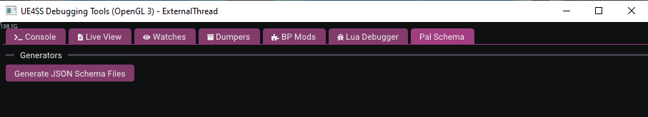
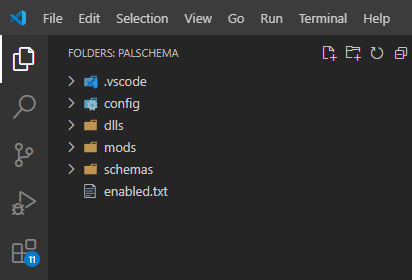
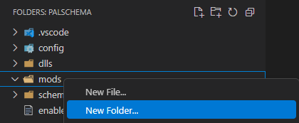
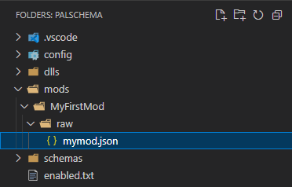
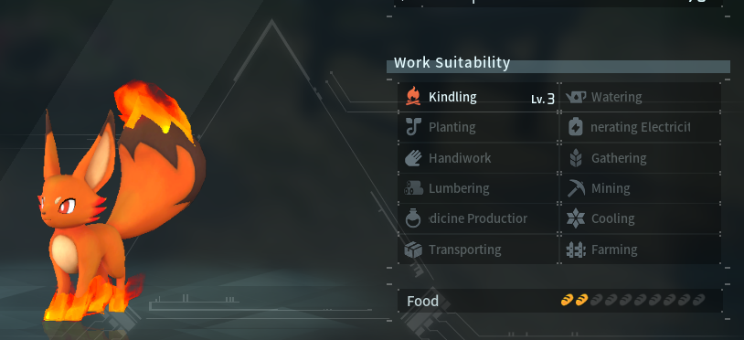

# Getting Started

## Essentials

* [Visual Studio Code](https://code.visualstudio.com/) - I heavily recommend getting this as it will make your life a lot easier when creating mods for PalSchema and I will explain in a bit why that is. Also don't mistake Visual Studio Code for Visual Studio which is an IDE rather than just a rich text editor. Visual Studio Code is very lightweight and is essentially just a better Notepad.

NOTE: Make sure to check `Add "Open with Code"` for both checkboxes as seen in the image below.


* [UE4SS Palworld](https://github.com/Okaetsu/RE-UE4SS/releases/tag/experimental-palworld) - You'll want to get the linked version for two reasons: 
  1. Palworld did some engine modifications which now requires a `MemberVariableLayout.ini` with UE4SS. If you don't get the linked version you will experience crashes with certain mods and PalSchema is one of them. See issue [here](https://github.com/UE4SS-RE/RE-UE4SS/issues/802).
  2. PalSchema is specifically built on the linked version of UE4SS. If you get the latest experimental that isn't the linked version, PalSchema will simply not work due to potential API incompatibility.

* [FModel](https://fmodel.app/) - Very useful for exploring Palworld files in general, you'll want this for referencing different data tables and assets in the game. Setup guide for FModel can be found [here](https://pwmodding.wiki/docs/developers/useful-tools/fmodel).

* [PalSchema](https://github.com/Okaetsu/PalSchema/releases) - You'll obviously need PalSchema itself. Select the latest available release and get the `PalSchema_x.x.x_Dev.zip` at the bottom under **Assets** where x.x.x is the latest version available.

Installation guide for PalSchema can be found in [here](./installation.mdx).

## Setting Up

Now that you've got everything installed, we want to setup a few things to make using PalSchema a bit easier.

### Generating Schema Files

1. Navigate to the `ue4ss` folder where you installed UE4SS and open up `UE4SS-settings.ini`.

2. Scroll down to the `[Debug]` section and set both `GuiConsoleEnabled` and `GuiConsoleVisible` to 1. UE4SS GUI Console is only recommended to be enabled during development due to performance impact so make sure to disable it when you're playing the game normally and not developing mods.

3. Launch Palworld and the UE4SS Debugging Tools window should appear.

4. Navigate to the Pal Schema tab and click on `Generate JSON Schema Files`. This will take a moment and you'll see a progress bar which will disappear once it's done generating the schema files.



:::warning
If you have graphical issues in the GUI Console, try changing `GraphicsAPI` from `opengl` to `dx11` or vice-versa.
:::

### The Mods Folder

Next, head over to the Mods folder where you installed PalSchema and right click on the PalSchema folder.

You should see an `Open with Code` option as seen in the image below.


VSCode (Visual Studio Code) will now be open in a new window and you should see the following on the top-left side if everything was installed and setup correctly:



* .vscode - This tells VSCode where to look for the schema files and which mods to apply each schema to, don't touch this.

* config - This is the [configuration](./configuration.md) file where you can enable/disable and modify certain features of PalSchema.

* dlls - This is where the main file for PalSchema resides and is the one handling loading of PalSchema mods, leave it be.

* examples - This contains example mods with comments that you can just drag into the mods folder and experiment with.

* mods - This is where you'll want to put your PalSchema mods.

* schemas - This is where VSCode will come in handy as it can read from the schema files inside to make sure our .json files are properly structured. Do not touch the files inside this folder.

## Creating a Mod

Now that we have all of that covered, let's get started. We'll start by editing an existing data table in the game.

### Folder Structure

1. Right-click on the `mods` folder in VSCode, select `New Folder...` and name it `MyFirstMod`. The folder we just created is the name of our mod which will show up as `MyFirstMod`.



2. Next, right-click on `MyFirstMod`, select `New Folder...` again and this time name it `raw`. We must call this folder `raw` since PalSchema applies different logic based on the subfolder's name. We will go through every subfolder name and their purpose at the end of this tutorial.

3. Once more, right-click on the `raw` folder, but this time you want to select `New File...`. We'll name it `mymod.json`, but you can call it anything as long as it ends with `.json` as this is the file extension required by PalSchema. [`.jsonc`](https://jsonc.org/) is also supported if you want to include comments in your file.

4. Your folder structure should now look like the image below.



### Introduction to JSON

Before we get into writing our mod, we'll want to go through some JSON basics. Note that this isn't meant to be a comprehensive tutorial to JSON and there are better resources for that on the internet if you google for it.

JSON stands for **JavaScript Object Notation** which is meant for expressing structured data and is used for a variety of things with PalSchema being one of those!

A JSON file will generally look like the below example:

```json
{
  "person": {
    "name": "Carl",
    "age": 30,
    "hasPets": true
  }
}
```

`{}` curly brackets indicate an object which contains key/value pairs where the key is always a string while the value can be different things. In this case `person` is the key and the content within the following `{}` is the value (`{
    "name": "Carl",
    "age": 30,
    "hasPets": true
  }`).

`name` is a string as indicated by the quotes `""` around the value `Carl`.

`age` is a number

`hasPets` is a boolean which can be either `true` or `false`

You'll notice the first opening and closing pair of `{}` don't have a key associated and that's because their only purpose is to serve as a container for the JSON file. You'll always want to start your JSON file with either `{}` or `[]`.

There's also `[]` square brackets which indicates a list of multiple values, for example:

```json
{
  "people": [
    {
      "name": "Carl",
      "age": 30,
      "hasPets": true
    },
    {
      "name": "Steve",
      "age": 32,
      "hasPets": false
    }
  ]
}
```

`people` contains a list of objects, but you can also use the square brackets with other values like numbers `[1, 2, 3, 4]` depending on what data is expected.

```json
{
  "numbers": [1, 2, 3, 4]
}
```

JSON supports six data types which are the following:

* String - "Hello World"
* Number and Integer - 13.37 and 128
* Boolean - true/false
* Null - Used to express emptiness
* Object - Container for key/value pairs
* Array - List of values

### Editing a Data Table

Let's start writing our mod now that we have the basics down.

1. Click on the `mymod.json` file which will open it in the editor.

2. Start by writing `{}` as covered in previous section. Your text cursor should be automatically placed in the middle of those curly brackets in which case press `Enter` to create some space so it looks like this:

```json title="mymod.json"
{

}
```

3. Next we want to create an object with a key of `DT_PalMonsterParameter` which will be the name of the data table we're targeting. There are 400+ data tables in the game to choose from, but for this tutorial we'll use `DT_PalMonsterParameter` which in FModel is located in `Pal/Content/Pal/DataTable/Character/DT_PalMonsterParameter` if you want to use it as a reference.

```json title="mymod.json"
{
  "DT_PalMonsterParameter": {
      
  }
}
```

You might notice that while writing the data table name, it'll show results for other data tables. This is called autocomplete and it's provided by the schema files in the `schemas` folder. 

You can press either `Enter` or `Tab` while the autocompletion box is open to have VSCode autofill for you.

4. We'll want to create another object where the key this time is the row name in the data table. We'll use `Kitsunebi` which is the internal identifier (ID) for Foxparks, see [Paldeck](https://paldeck.cc/pals) for a comprehensive list of IDs for different things.


```json title="mymod.json"
{
  "DT_PalMonsterParameter": {
    "Kitsunebi": {
      
    }
  }
}
```

Let's modify the properties of `Kitsunebi` (Foxparks) and give it a bit of a buff.

5. Inside the `Kitsunebi` row object, start writing `WorkSuitability_EmitFlame` which is Kindling and it should show up a bunch of suggestions. Hit `Tab` or `Enter` to autocomplete on `WorkSuitability_EmitFlame` and it should fill in `WorkSuitability_EmitFlame: 0`, we'll set the value to 3.

```json title="mymod.json"
{
  "DT_PalMonsterParameter": {
    "Kitsunebi": {
      "WorkSuitability_EmitFlame": 3
    }
  }
}
```

:::tip
PalSchema will only modify properties and rows that we target in our `.json` files which means every other value will be left as is. This is ideal to prevent conflicts with other mods that can happen with other methods of editing the game's asset files due to those methods overwriting the entire asset rather than only the targeted values.
:::

## End Result

Launch the game, load up into the game and try to find yourself a Foxparks if you don't have one yet. If we look at the Kindling level for Foxparks, we'll see it's at Lv. 3 now!



Congrats, you've made your first PalSchema mod! You should now be equipped with the knowledge to start modifying some data tables or even add new data!

I recommend checking the **Guides** section in the docs as well since there's a lot of things you can do with PalSchema like adding new items, buildings or even pal variants if that's something you're interested in.

## Final Notes

I promised earlier to cover the different folder types aside from `raw` and this is very important to understand and remember.

* `appearance` - This is where character creation related mods go like hair styles, eyes, head types, colors, etc...

* `blueprints` - Blueprint edit asset mods go in here. [Intro to Blueprint Editing](./guides/blueprints/intro.md).

* `buildings` - [Building related](./guides/buildings/craftingstation.md) mods go here.

* `enums` - This is where you can [add new enums](./guides/enums/newenums.md).

* `helpguide` - Survival Guide related mods go here. [Working with Survival Guide](./guides/helpguide/intro.md).

* `items` - [Item related](./guides/items/creatingabow.md) mods go here.

* `pals` - Pal related mods go here.

* `raw` - This is for any data table mods and as the name implies, it has no hand holding safety logic in PalSchema like the other mod types.

* `skins` - Pal skins and any other future skin types like buildings, weapons, etc.

* `spawns` - Custom spawners for pals and npcs go in here. [Custom Spawners](./guides/spawners/overview.md).

* `translations` - This is where translations for anything in the game goes and you can specify which language the translation is for by naming the folder after any of the localizations listed in the L10N folder of Palworld or you can also do custom localization. Palworld natively supports de, en, es, fr, it, ko, pt-BR, ru, zh-Hans, zh-Hant and you can easily add support for other unsupported languages with custom localization mods. [Intro to Translations](./guides/translations/intro.md).