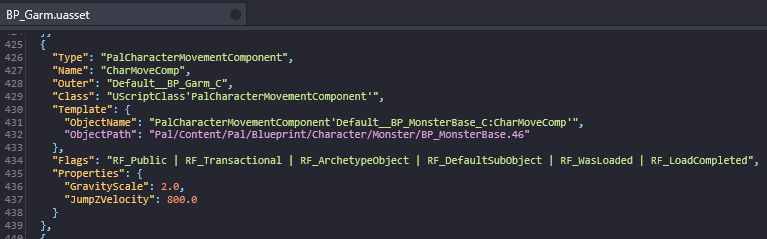
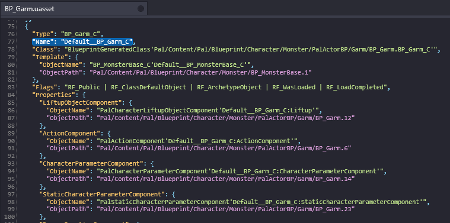
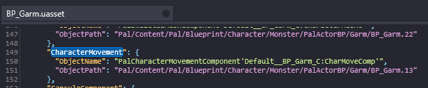
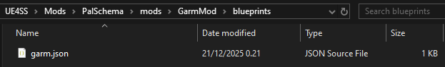

# Blueprint Components

There's a little more to editing a blueprint's components so I'll walk you through it. Please check the [Intro to Blueprint Editing](./intro) if you're new to modifying blueprints with PalSchema.

## Finding the Component

In this example we'll be editing Direhowl.

Let's look at `Pal/Content/Pal/Blueprint/Character/Monster/PalActorBP/Garm/BP_Garm.uasset` in [FModel](https://pwmodding.wiki/docs/developers/useful-tools/fmodel). Open the asset, hit Ctrl+F and look for `PalCharacterMovementComponent`.



You'll see the names `PalCharacterMovementComponent` and `CharMoveComp`. You don't want to use either of these, instead I will show you where to find the correct component name that you need to be using.

Take a note of the asset's name that we're editing which is `BP_Garm`. As you may remember from the blueprint intro, we added a `_C` at the end to indicate the class so it becomes `BP_Garm_C`.

Now, we'll want to add `Default__` in front of `BP_Garm_C` so it becomes `Default__BP_Garm_C`. Do you see a theme here? If not, here's an example with `BP_PinkCat` (Cattiva):

`BP_PinkCat` -> `BP_PinkCat_C` -> `Default__BP_PinkCat_C`. Very simple.

Next, hit Ctrl+F and search for `"Name": "Default__BP_Garm_C"`.


You should now see a list of default properties for the default object of `BP_Garm` and among those properties are our Direhowl's components.



Scroll down a bit and you should see our `PalCharacterMovementComponent` in this properties list.



`CharacterMovement` is the correct name that we need to be using to edit the component.

## Editing our Component

Now that we have found our component, let's get to editing.

Setup your mod folder within PalSchema's mods folder. It should look something like `GarmMod/blueprints/garm.json`.



Open `garm.json` and copy the following into it. We'll be editing `JumpZVelocity` to 3200.0 which is what controls how high a pal can jump.

```json
{
    "BP_Garm_C": {
        "CharacterMovement": {
            "JumpZVelocity": 3200.0
        }
    }
}
```

Now if we load into a world and jump while riding a Direhowl, we should jump much higher!

