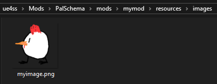
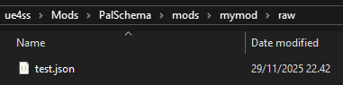
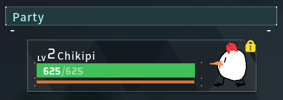

# Importing Images as Textures

Importing images is a new feature in 0.5.0 where you'll be able to import `.png`, `.jpg`, `.jpeg`, `.bmp` and `.tga` images into the game for use with your mods. This allows you to skip the Unreal Editor packaging process entirely if you just want to add item icons for example.


Example Usage
-------------

Project Structure  
`mymod/resources/images/myimage.png`  
  

`mymod/raw/test.json`  


Where `mymod` is the name of your mod and `myimage` is the name of your image file. Note that when you're importing images, you must place your images within an `images` folder in the `resources` folder, otherwise they will be ignored.

You can then reference your image within any [`TSoftObjectPtr`](../../types/softobjectptr.md) field by entering the following string instead of the usual asset path: `$resource/modname/filename`.

- `$resource/` tells PalSchema that it should look for an imported resource.

- `modname` is the name of the mod that imported a resource, in our case it would be `mymod`.

- `filename` is the name of the file inside the resources folder, so since we have a `myimage.png` file, you want it without the extension so it would become `myimage`.

`test.json`

```json
{
    "DT_PalCharacterIconDataTable": {
        "ChickenPal": {
            "Icon": "$resource/mymod/myimage"
        }
    }
}
```

Here's the final result:  


You can utilize this feature for various things like the survival guide, building icons, pal icons, item icons and much more!